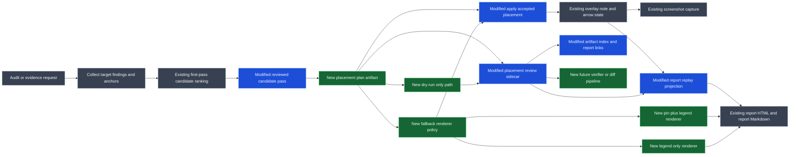
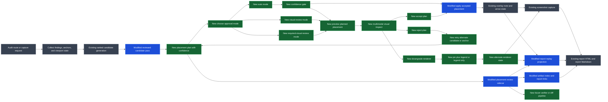

# Annotation Placement Reflow Design

## Purpose

This note defines the next stable shape for annotation placement in `overlay-playwright-runtime`.

The immediate goal is not to make note placement "smart" in an unbounded way. The goal is to make it:

- deterministic by default
- self-healing when deterministic first-pass placement is poor
- reversible and dry-runnable
- inspectable through artifacts instead of hidden heuristics

## Design stance

### Deterministic first

The default path should continue to be geometric and repeatable:

- generate a small ranked candidate list
- apply explicit rejection rules
- keep stable tie-breaking
- persist the reason a candidate was rejected or accepted

This is the correct default because it is:

- easier to test
- easier to diff
- easier to explain in reports
- less likely to drift across runs

### Agent-led only as bounded fallback

Agent judgment should not be the default note placer.

Agent involvement is useful only when:

- all deterministic candidates are bad
- renderer downgrade is needed
- an annotation cluster should be collapsed
- evidence should be summarized rather than exhaustively drawn

Even then, the output should still be written back as a plan or sidecar artifact so the run remains auditable.

### Multimodal review is part of the policy, not an accident

The agent should not have to "remember" on its own that a visual check may be needed.

The workflow should make visual inspection explicit when the plan is risky or ambiguous.

That means:

- dry-run should be able to produce a previewable capture
- the agent can inspect that capture with a multimodal read step
- acceptance should be policy-driven, not left implicit

### Auto means trust but verify

`auto` should not mean "skip inspection."

It should mean:

- trust the deterministic planner first
- run self-healing retries when needed
- visually verify when confidence is not high enough for blind acceptance

This is the intended posture for a multimodal agent:

- deterministic by default
- visually aware when needed
- auditable either way

### Self-healing over improvisation

If the first deterministic result is poor, the system should try to repair itself before escalating:

- retry alternate candidates
- retry alternate anchors
- downgrade from sticky note to pin plus legend when needed
- fall back to legend-only when no good anchor survives

This is preferred to freehand adjustment because it is more resilient and easier to replay.

### Plan and apply must be separable

The core workflow should split placement into explicit phases:

1. `plan`
2. `apply`
3. `replay`

That enables:

- dry runs
- debuggable artifacts
- deterministic tests
- future verifier diffs

## Proposed workflow

### 1. Plan

The planner should produce a placement plan without mutating the live page.

Inputs:

- anchor candidates
- annotation text or structured message
- viewport data
- existing note boxes
- nearby peer controls
- current capture policy

Outputs:

- ranked placement candidates
- rejection reasons
- accepted candidate or fallback strategy
- renderer mode recommendation

### 2. Apply

Apply should consume a plan and materialize it in the live overlay session.

Allowed outputs:

- sticky note plus arrow
- sticky note only
- pin plus legend entry
- legend-only entry

Apply should not recompute strategy unless explicitly asked.

### 2.5. Review and approve

Between plan and apply, the workflow should support explicit approval policy.

Approval modes:

- `auto`
  - trust but verify
  - auto-accept only when placement confidence is high
  - escalate to multimodal preview inspection when confidence is medium or low
- `visual-review`
  - always preview and inspect before final acceptance
- `required-visual-review`
  - block final apply or finalize until the preview has been visually checked

This phase is where the multimodal agent should inspect the capture artifact and either:

- accept the plan
- reject the plan and retry a different candidate
- switch renderer policy

### 3. Replay

Replay should re-render the same plan into:

- report HTML overlays
- report Markdown summaries
- screenshot annotation overlays
- future sidecar-based alternate renderers

Replay should be able to clamp and adapt to the report frame, but it should preserve the original accepted strategy and reasons.

## Core policy

### Hard constraints

- never cover the target
- never accept a stale or zero-sized anchor as normal placement
- never accept note-over-note overlap

### Soft penalties

- overlap with nearby peer controls in the same band
- long arrow distance
- low free margin
- note obscuring the primary subject area

### Confidence bands

The plan should carry an explicit confidence level.

- `high`
  - no overlap
  - no fallback
  - short arrow
  - healthy free margin
- `medium`
  - one retry
  - narrow viewport
  - near peer controls
  - visually plausible but worth checking
- `low`
  - only compromised candidates survive
  - renderer downgrade is likely
  - target or page context is still visually crowded

These confidence bands should drive the approval mode behavior.

### Self-healing order

1. retry ranked candidates
2. retry alternate anchors
3. switch renderer to pin plus legend
4. degrade to legend-only
5. optionally allow agent-selected override

## Contracts and artifacts

### Placement plan

The planner should emit a structured plan record.

Minimum shape:

```json
{
  "version": 1,
  "surface": "desktop",
  "label": "Status",
  "target": {
    "text": "Status",
    "rect": { "left": 0, "top": 0, "right": 0, "bottom": 0 }
  },
  "candidates": [
    {
      "side": "right",
      "score": 0,
      "rejected": true,
      "reasons": ["overlaps-peer-control"]
    }
  ],
  "accepted": {
    "side": "below",
    "renderer": "sticky-note",
    "retried": true
  }
}
```

### Placement review sidecar

The current `placement-review.json` is the first step toward this contract.

Next it should evolve from a summary of accepted placements into a real `plan/apply/replay` record.

### Dry-run mode

The planner should support a dry-run path that:

- computes plans
- writes JSON
- can optionally render preview evidence
- does not mutate overlay annotations

This is important for both tests and future agent handoff.

### Preview artifact

Dry-run should be able to emit a preview artifact suitable for multimodal inspection.

That preview can initially be:

- a standard screenshot with projected planned notes and arrows

Later it can expand to:

- pin plus legend preview
- legend-only preview
- side-panel review HTML

### Codex lifecycle hook

The skill-level review hook remains the source of truth:

- `previewPlannedAnnotation(...)` writes the preview screenshot, preview HTML, flat preview image, and preview JSON.
- `reviewPlannedAnnotation(...)` writes the review descriptor with `requiresVisualReview`, `confidence`, `suggestedNextAction`, and `inspectionTargetPath`.

Codex lifecycle hooks are useful as an agent-orientation layer on top of that contract. When `reviewPlannedAnnotation(...)` emits a descriptor with `requiresVisualReview: true`, it also appends a queue entry to `.codex/state/overlay-review-queue.jsonl` when the current repo has a `.codex/` directory.

The repo-local `PostToolUse` hook reads that queue after Bash commands. If it finds a new required review, it returns a hook message that tells the agent exactly which flat image to open with the local image viewer before applying or downgrading the planned placement. This makes `auto` a trust-but-verify mode in practice:

- high confidence: apply directly
- medium confidence: generate preview and inspect the flat image when requested
- low confidence: inspect, then retry/reflow or downgrade renderer

The Stop hook is intentionally deferred. It can later enforce that no pending required visual review is left uninspected at turn end, but `PostToolUse` is the lower-friction first integration point.

## Recommended implementation order

### Step 1

Keep the current reviewed candidate pass, but refactor its output into a plan object instead of a bare accepted placement.

### Step 2

Split the current helper into:

- `planViewportSafeNotePlacement(...)`
- `applyPlannedAnnotation(...)`

### Step 3

Add `previewPlannedAnnotation(...)` and make it usable in dry-run plus multimodal review.

### Step 4

Reuse the same plan in report replay so live placement and report projection do not drift.

### Step 5

Add renderer downgrade policy:

- sticky note
- pin plus legend
- legend-only

### Step 6

Replace `placement-review.json` with a richer `annotations.json` sidecar that can carry both plan and applied results.

## Full workflow

Legend:

- gray: existing stable path
- blue: modified path
- green: new path



## Interpretation of the workflow

### Existing stable path

The current system already has:

- runtime findings
- anchor selection
- first-pass candidate ranking
- live note and arrow application
- screenshot capture
- report generation

That foundation stays.

### Modified path

The current reviewed candidate pass and placement-review sidecar are transitional. They should be treated as the modified bridge between the old direct-placement flow and the new plan-based flow.

### New path

The real target state adds:

- explicit planning
- explicit dry-run support
- explicit multimodal approval policy
- explicit fallback renderer policy
- explicit replay from plan artifacts
- future verifier compatibility

## Approval policy

### `auto`

`auto` means trust but verify.

Expected behavior:

1. plan deterministically
2. run self-healing retries
3. inspect confidence
4. if confidence is high, accept directly
5. if confidence is medium or low, inspect the preview artifact before acceptance

### `visual-review`

Always preview and inspect before acceptance, even if confidence is high.

This is useful for:

- dense navigation bands
- mobile viewports
- review screenshots intended for humans

### `required-visual-review`

Do not finalize the placement without multimodal inspection.

This is useful for:

- fallback renderer cases
- compromised placements
- evidence that will be used in reports or external review

## More specific workflow

Legend:

- gray: existing stable path
- blue: modified path
- green: new path



## Practical recommendation

In practice, placement should remain mostly deterministic.

The system should only become more "agent-led" at the policy level:

- choose whether to preview and inspect
- choose whether to apply
- choose whether to degrade renderer
- choose whether to summarize or cluster

It should not become freeform geometry editing by default.
