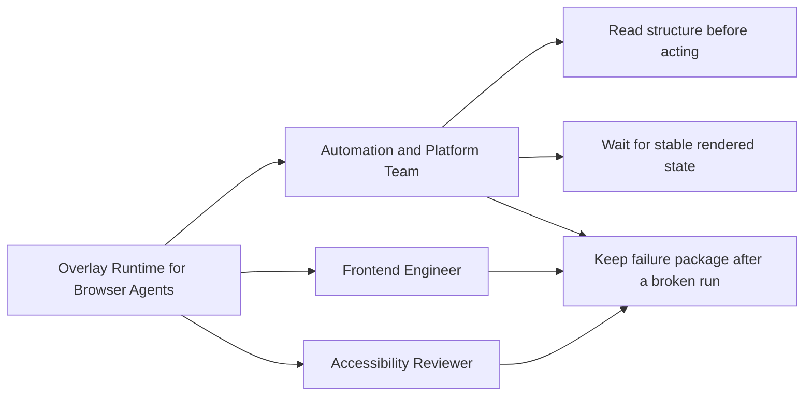
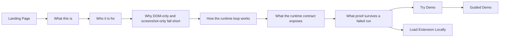
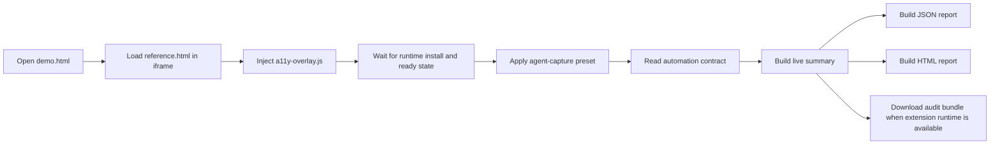
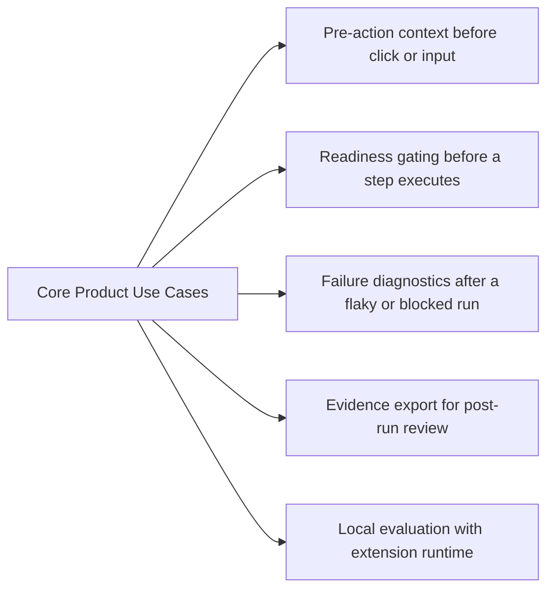
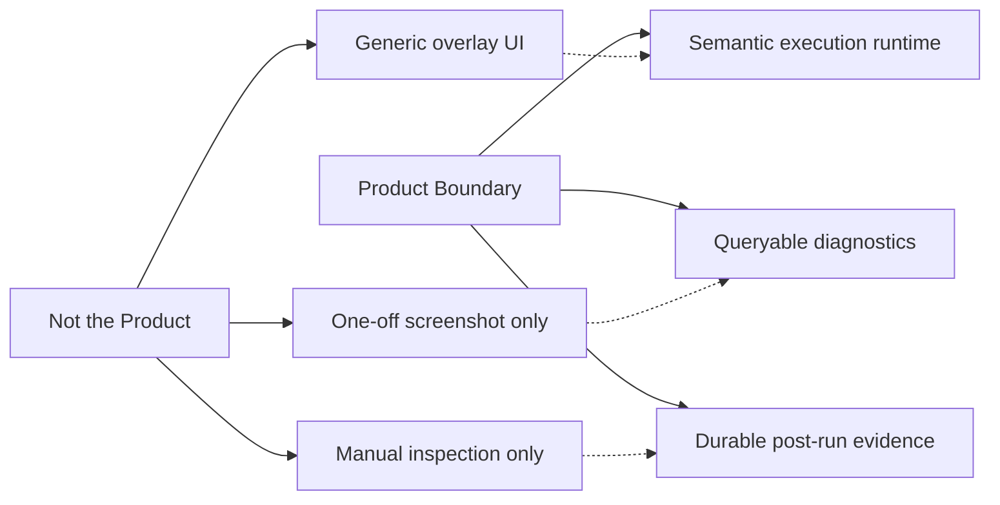

# Overlay Runtime Use Cases

This file captures the buyer-led use cases introduced by the new landing page and guided demo surface.
The structure below is also the source outline for an Excalidraw-safe Mermaid diagram generated from the same content.

## Buyer-Led Surface

- Primary buyer: automation and platform teams running Playwright or browser agents.
- Adjacent users: frontend engineers and accessibility reviewers who consume the same evidence.
- Core jobs: read structure before acting, wait on stable rendered state, and keep the failure package after a broken run.

## Site Story Flow

- The landing page explains what the runtime is, who it is for, and why DOM-only or screenshot-only tooling is insufficient.
- The primary CTA sends the user to the guided demo.
- The secondary CTA sends the user to the local extension install path.

## Guided Demo Flow

- Open `demo.html`.
- Load `reference.html` in a same-origin iframe.
- Inject `a11y-overlay.js`.
- Wait for the runtime to install and settle.
- Apply the `agent-capture` preset.
- Read the automation contract and generate JSON or HTML reports.

## Core Product Use Cases

- Pre-action context for browser agents before click or input.
- Readiness gating before a step executes.
- Failure diagnostics after a flaky or blocked run.
- Evidence export for post-run review and handoff.
- Local evaluation with extension runtime when available.

## Product Boundary

- Not a generic overlay UI.
- Semantic execution runtime for browser automation.
- Queryable diagnostics and durable post-run evidence.

### Excalidraw-Safe Mermaid

The diagrams below stay within the conservative Mermaid subset that imports cleanly into Excalidraw.
The consolidated companion output generated with the `excalidraw-mermaid-safe` skill is saved in `docs/use-cases-excalidraw.mmd`.

